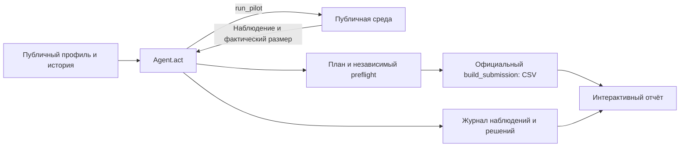

# tandem — агент тарифных кампаний

Аналитик маркетинга получает план: **кому предложить тариф, через какой канал
и на основании каких пилотов**. Агент исследует аудиторию в пределах общего
бюджета, обновляет оценки после наблюдений и возвращает 1–10 кампаний.
Результат — CSV и интерактивный отчёт с основаниями решений.

Beeline Tariff Marketing Campaigns Case. Все данные и эффекты синтетические;
результаты не описывают реальный бизнес Beeline.

## Установка и первый запуск

Нужен **полный репозиторий и Python 3.12**. Сохранены проверки с CPython
3.12.13 и 3.12.14, NumPy 2.5.3, pandas 3.0.6. Команды выполняются из корня репозитория.
GPU, API-ключи, переменные окружения и личные подписки не требуются.
Сеть нужна для первоначального получения зависимостей; расчёт работает локально.

### Windows PowerShell

Убедитесь, что `python --version` показывает Python 3.12:

```powershell
python -m venv .venv
.venv\Scripts\python.exe -m pip install -r requirements.txt
.venv\Scripts\python.exe tools/verify_submission.py
.venv\Scripts\python.exe tools/run_demo.py
```

### Linux / macOS

```bash
python3.12 -m venv .venv
.venv/bin/python -m pip install -r requirements.txt
.venv/bin/python tools/verify_submission.py
.venv/bin/python tools/run_demo.py
```

Сохранённые проверки чистой установки выполнены на Windows; отдельная
приёмка на Linux/macOS в репозитории не зафиксирована.

[Независимая приёмка версии `571cb75`](reports/final_acceptance/README.md):
новый clone и новое окружение, официальные команды, 44 теста,
интерактивные вкладки и скачивание CSV/JSON прошли. Проверка браузера выполнена
через localhost; прямое открытие `file://` и другой физический компьютер
не проверены. После отключения сети у уже загруженной страницы интерфейс
и скачивания продолжили работать.

**Ожидаемый результат:** проверка выводит строки `OK`, `"passed": true` и
завершается с кодом 0. Полный запуск выводит `Status: complete` и путь к новому
`decision_report.html`. Откройте этот файл в браузере. Для текущего seed 42:
**3 кампании, 20 пилотов, 5 976 контактов и 30 632 у.е. расходов вместе
с пилотами**. Это расходы и число контактов, не прибыль и не уникальные клиенты.

`verify_submission` повторно формирует CSV в отдельном процессе и сравнивает
его с сохранённым. `run_demo` дважды выполняет агента и создаёт новые CSV,
JSON и HTML в отдельной папке `reports/demo_runs/run_.../`. Старые результаты
для расчёта не используются. Обе команды не перезаписывают корневые артефакты.
При ошибке полного запуска смотрите `run_status.json` и `*_stderr.txt`
в напечатанной папке; статус `failed` означает незавершённый сценарий.

## Основной сценарий аналитика

1. Выполнить полный запуск выше и открыть созданный HTML.
2. Выбрать кампанию: посмотреть аудиторию, тариф, канал, затраты и прямые пилоты.
3. Сравнить четыре канала для той же аудитории: расходы, модельные оценки,
   изменение оценки и допустимость бюджета всего плана.
4. Перейти в журнал наблюдений или скачать CSV плана и JSON запуска.

Для готового примера скачайте [сохранённый HTML](reports/decision_report.html).
GitHub показывает его исходник; интерактивный просмотр доступен при локальном
открытии. Все данные встроены, просмотр не требует сети или сервера.
HTML показывает сохранённые решения; реальная отправка сообщений клиентам
и интеграция с CRM в прототипе не реализованы.

**Пример для проверки:** `tandem_03`, переход `tariff_8 → tariff_10` в MID.
Пилоты №5 и №19 связаны с карточкой кампании. После учёта неопределённости,
приблизительного повторного охвата и затрат оценка Push равна **+1 013 у.е.**,
SMS — **−5 563 у.е.** Замена на звонки превышает бюджет. Это модельное
объяснение одной замены канала, не измеренная прибыль и не повторная
оптимизация портфеля. [Исходные числа и ограничения](docs/evidence.md#разбор-одного-решения).

## Где проверить заявленные возможности

| Возможность | Реализация | Доказательство / проверка |
|---|---|---|
| Следующие пилоты зависят от наблюдений | [Agent.act](agent.py), [Belief.observe](strategy/beliefs.py) | [Журнал запуска](reports/decision_trace.json), [сравнение с фиксированным расписанием](docs/adaptivity_ablation.md) |
| Эффект оценивается вместе с неопределённостью | [Обновление оценок](strategy/beliefs.py), [варианты кампаний](strategy/portfolio.py) | Среднее и разброс после пилотов в журнале; [описание поправки 1.65σ](docs/approach.md) |
| Кампании помещаются в лимиты и не пересекаются | [Планировщик](strategy/portfolio.py), [валидатор](validation/plan.py) | `tools/verify_submission.py`; поле `preflight` в журнале |
| CSV воспроизводится официальным генератором | [make_submission.py](make_submission.py), [экспорт](tools/export_strategy.py) | Два одинаковых seed-42 экспорта и сверка сохранённого CSV |
| Выбор канала можно разобрать | [Пересчёт альтернатив](tools/channel_explanations.py), [отчёт](docs/decision_report.md) | Восстановление показателей выбранной кампании из журнала и профиля перед показом альтернатив |
| Полный сценарий создаёт результат заново | [tools/run_demo.py](tools/run_demo.py) | [Запуск без готовых артефактов](reports/fresh_demo_check.json), [проверка альтернатив](reports/channel_explanation_check.json) |

## Измеренные результаты и их границы

На официальном mock агент дал **10/10 допустимых положительных результатов**
на seed 0–9: медиана net **1 434 332 у.е.**, минимум **1 058 935 у.е.**
На дополнительной серии seed 10–29 — **20/20**, медиана **1 137 656 у.е.**,
минимум **653 339 у.е.** Шаблон на seed 0–9 дал 0/10 положительных результатов;
один финальный план шаблона был недопустим.

Источники: [основная серия](reports/benchmark_review_agent.json),
[дополнительная](reports/benchmark_review_additional.json),
[шаблон](reports/benchmark_review_template.json). Это измерения ревизии
`95e4555`, а не новый benchmark текущего HEAD. Политика выбора сохранена;
позднее добавлены проверка финала, дополнительные поля журнала и инструменты отчёта.
Новая [официальная серия на `571cb75`](reports/final_acceptance/local_eval_ten_stdout.txt)
в чистом окружении подтвердила 10/10 положительных результатов и те же
округлённые медиану и минимум на seed 0–9.

**Универсальное превосходство не доказано.** В исследовании адаптивности
на семи синтетических моделях агент выиграл все 10 пар в `mixed_2`,
фиксированное расписание — все 10 в `rare_1`. В обеих `rare`-моделях ни одна
политика не обнаружила выгодное сочетание. Есть отрицательные сценарии;
новые seed той же модели не проверяют скрытые эффекты.
[Карта результатов, версий и неудачных вариантов](docs/evidence.md).

## Архитектура



Локальный evaluator отдельно считает net по пилотам и финальному плану.
Скрытая модель эффекта не передаётся планировщику. `Agent().act(env)` получает
публичный интерфейс среды; состояние создаётся заново при каждом вызове.
У агента нет собственной случайности, сетевых вызовов или зависимости от LLM.

Алгоритм: слабые исторические предположения → пилоты по ARPU-стратам →
выбор следующего наблюдения по ценности информации → обновление среднего
и разброса → непересекающийся портфель с учётом каналов и оставшихся ресурсов.
[Формулы, причины решений и ограничения](docs/approach.md).

## Официальный запуск и экспорт

Из корня репозитория, после установки зависимостей:

```powershell
.venv\Scripts\python.exe local_eval.py
.venv\Scripts\python.exe local_eval.py --runs 10
.venv\Scripts\python.exe make_submission.py
```

На Linux/macOS используйте `.venv/bin/python` вместо `.venv\Scripts\python.exe`.
`make_submission.py` **перезаписывает корневой `submission.csv`** официальным
seed-42 результатом. `local_eval` считает синтетический net; его `PASS`
означает положительный результат и не заменяет проверку всех ограничений.

После изменения агента обновите согласованные артефакты:

```powershell
.venv\Scripts\python.exe tools/export_strategy.py
.venv\Scripts\python.exe tools/verify_submission.py
.venv\Scripts\python.exe tools/render_decision_report.py
```

Экспорт сохраняет CSV и `reports/decision_trace.json`: наблюдения, оценки,
preflight, версии и хеши входных данных/исходников. Перед записью требует
совпадения двух экспортов. Генератор HTML сам агента не запускает и отказывает
при несогласованных входах. Сравнение каналов закреплено на текущей реализации;
после изменения её исходников требуется пересмотреть адаптер объяснений.
Подробности: [отчёт](docs/decision_report.md), [валидатор и benchmark](docs/validation.md).

## Комплектность и данные

Запускайте **проект целиком**: `agent.py` импортирует `strategy/` и `validation/`,
читает историю `data/change_tariff.csv` относительно своего расположения.
Локальной среде нужны `customer_profile.csv` и `data/dict_tariff.csv`.
Официальные файлы включены в репозиторий. Сохранённый отчёт проверяет также
справочник и полный набор файлов из своего манифеста.

- Профиль: 23 441 уникальный абонент, 21 тариф; история: 14 823 перехода.
- Общие лимиты: 100 000 у.е., 15 000 контактов с пилотами, до 20 пилотов
  по 10–200 клиентов, 1–10 финальных кампаний до 5 000 контактов каждая.
- В профиле есть пропуски; история относится к другим клиентам. Персональное
  соединение этих таблиц по ID не используется. [Аудит данных](docs/data_analysis.md).
- Хеши текстовых файлов используют CRLF→LF (`sha256-text-lf-v1`).
  Старые измерения и неудачные проверки сохраняются с указанием их версий.

## Источники, зависимости и вклад

Собственная реализация команды: выбор пилотов и обновление знаний,
подбор портфеля, независимая валидация, экспорт с происхождением результата,
отчёт для аналитика и исследовательские сравнения.

`agent_template.py`, `environment.py`, `mock_environment.py`, `scoring_core.py`,
`local_eval.py`, `make_submission.py`, CSV и `PARTICIPANT_GUIDE.md` предоставлены
[организатором](https://drive.google.com/file/d/1cQUKtE_cm9TVXgzpcFwQYYUpmuFaJHHT/view)
и включены без изменений. Они не являются собственной разработкой команды;
условия исходных материалов не заменяются новой лицензией проекта.

Прямые зависимости: NumPy для численных операций и pandas для таблиц;
версии закреплены в [requirements.txt](requirements.txt). Отчёт и его генератор
используют стандартную библиотеку Python и обычный браузер. Для разработки
добавляется pytest из [requirements-dev.txt](requirements-dev.txt).

Команда использует Codex для анализа, разработки и документации. Devin
подготовил исходную независимую валидацию и инструменты benchmark/stress;
они прошли ревью и доработку при интеграции. Участники проверяют результаты
AI и отвечают за решения. AI использован при разработке; в рабочем алгоритме
применяются статистическое обновление и планирование, вызовов LLM нет.

## Направления развития

Следующие возможности **не реализованы**: интеграция с CRM и отправка кампаний,
калибровка модели на реальных контролируемых экспериментах, пользовательские
ограничения частоты контактов, мониторинг смены поведения аудитории.
Первый исследовательский приоритет — улучшить обнаружение редких выгодных
предложений без роста потерь на плохих сегментах; существующие эксперименты
не подтвердили универсального решения.
[План развития и условия проверки](docs/approach.md#дальнейшее-развитие).
