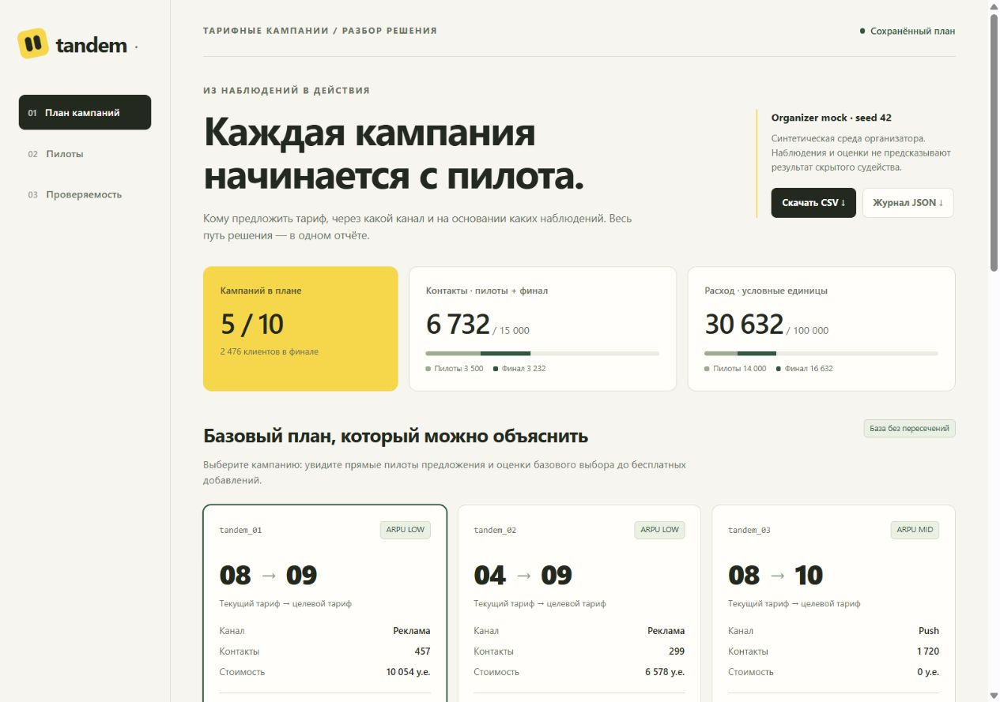

# tandem - агент тарифных кампаний

Автономный агент для **Beeline Tariff Marketing Campaigns Case**. По профилю
клиентов и истории переходов выбирает пилоты, обновляет оценки по их результатам
и формирует 1–10 кампаний: аудитория, целевой тариф и канал связи.
Выход - **CSV для официального оценщика и HTML с основаниями решений**.

## Результаты и доказательства

| Что проверено | Результат | Источник |
|---|---|---|
| Запуск в новом clone и окружении | **37 runtime-проверок; 122 теста, 0 пропусков** | [Независимая приёмка v1.3](reports/push_acceptance/README.md), [сводка JSON](reports/push_acceptance/acceptance.json) |
| Текущий Agent на официальном mock, seed 0–9 | **10/10 положительных**; медиана net **1 476 624**, минимум **1 058 935** у.е. | [Вывод оценщика](reports/push_integration/local_eval_ten_stdout.txt), [условия запуска](reports/push_integration/README.md) |
| Бесплатные Push против исходной политики | **134 улучшения, 26 равенств, 0 ухудшений** в 160 парах | [Методика и доказательство](docs/push_overlay.md), [сводка](reports/push_overlay/full_holdout.json), [все пары](reports/push_overlay/full_holdout.jsonl) |
| Адаптивные пилоты против фиксированного расписания | 70 пар: `mixed_2` — 10/10 побед; `rare_1` — 10/10 поражений; mock — 5 побед и 5 поражений | [Сравнение политик](docs/adaptivity_ablation.md), [исходные результаты](reports/adaptivity_ablation/comparison.json) |
| Отчёт и скачивание результатов | Вкладки, кампании, фильтры и прокрутка проверены; CSV/JSON совпали побайтно, ошибок JavaScript нет | [Браузерная проверка](reports/push_acceptance/browser_results.json), [скачивания](reports/push_acceptance/download_verification.json) |

Это отдельные проверки с разными исходными версиями; их связь с текущим кодом
указана в [карте доказательств](docs/evidence.md). Чистая установка проверена
на Windows/Python 3.12.14, интерфейс — Chrome через localhost. Проверка при
принудительно отключённой сети, на других ОС и втором компьютере не проводилась.
Данные синтетические; результаты сравнений относятся к нашим политикам.

## Запуск и проверка

Нужны **Python 3.12 и полный репозиторий**. Зависимости NumPy 2.5.3 и pandas 3.0.6
закреплены в [requirements.txt](requirements.txt). API-ключи и GPU не требуются.

```bash
git clone https://github.com/BAITC-Hacks/hack-84050a93-tandem.git
cd hack-84050a93-tandem
```

Вместо clone можно распаковать **Code → Download ZIP** с GitHub.
Все команды ниже выполняются из папки с `agent.py`.

**Windows PowerShell:**

```powershell
python -m venv .venv
.venv\Scripts\python.exe -m pip install -r requirements.txt
.venv\Scripts\python.exe tools/verify_submission.py
.venv\Scripts\python.exe tools/run_demo.py
```

**Linux / macOS:**

```bash
python3.12 -m venv .venv
.venv/bin/python -m pip install -r requirements.txt
.venv/bin/python tools/verify_submission.py
.venv/bin/python tools/run_demo.py
```

Ожидаемый результат: `verify_submission` выводит `"passed": true`; полный запуск —
`Status: complete` и путь к папке с **submission.csv, decision_trace.json,
decision_report.html**. Скрипт `run_demo.py` выполняет агента дважды, проверяет
совпадение CSV и строит отчёт из нового расчёта. При ошибке причина записана
в `run_status.json` и `*_stderr.txt` этой папки.

Для просмотра проверенным способом подставьте напечатанную папку запуска:

```powershell
.venv\Scripts\python.exe -m http.server 8765 --bind 127.0.0.1 --directory "<папка_запуска>"
```

Откройте **http://127.0.0.1:8765/decision_report.html**. В Linux/macOS используйте
`.venv/bin/python` вместо `.venv\Scripts\python.exe`.

### Контрольный результат seed 42

| Показатель | Значение |
|---|---:|
| Финальные кампании | 5: 3 основные + 2 бесплатные добавки |
| Пилоты | 20 |
| Контакты вместе с пилотами | 6 732 |
| Расход вместе с пилотами | 30 632 у.е. |
| Уникальные клиенты финальных кампаний | 2 476 |

В HTML выберите `tandem_03`: переход `tariff_8 → tariff_10` в MID связан с
пилотами №5 и №19. Проверьте сравнение четырёх каналов, основания бесплатных
добавок, журнал наблюдений и скачивание полного CSV/JSON.

[Сохранённый CSV](submission.csv) · [Журнал JSON](reports/decision_trace.json) ·
[Сохранённый HTML](reports/decision_report.html) · [Описание полей отчёта](docs/decision_report.md).
GitHub показывает исходник HTML; интерфейс открывается локально.



## Как работает агент

1. **Выбирает эксперименты.** История задаёт слабые начальные оценки. Агент
   исследует разные ARPU-сегменты, выбирает следующие пилоты по ценности информации
   и повторно измеряет перспективные предложения. [agent.py](agent.py),
   [обновление оценок](strategy/beliefs.py).
2. **Собирает основной план.** Оценивает тарифы и каналы с учётом стоимости,
   неопределённости и оставшихся ресурсов; основные аудитории не пересекаются.
   [Планировщик](strategy/portfolio.py), [формулы](docs/approach.md).
3. **Добавляет бесплатные Push.** Сохраняет основной план и использует только
   аудиторию основной кампании либо ячейку, полностью охваченную одним пилотом.
   При проверенных условиях правило максимального эффекта официального scorer
   даёт неубывание net. [Реализация](strategy/full_coverage_push.py),
   [условия и ограничения](docs/push_overlay.md).
4. **Проверяет результат.** Независимые валидаторы пересчитывают аудитории,
   бюджет, контакты и доказательства охвата. HTML связывает кампании с пилотами
   и проверяет согласованность CSV, журнала, данных и исходников.
   [Проверка плана](validation/plan.py), [проверка Push](validation/overlay.py).

Рабочий алгоритм — Python, NumPy и pandas; интерфейс отчёта — HTML/CSS/JavaScript.
Агент использует публичный интерфейс среды и не получает скрытую модель эффекта.
Расчёт выполняется локально, без вызовов LLM. [Архитектура и решения](docs/approach.md).

## Данные, ограничения и повторение измерений

Включены профиль **23 441 клиента**, **21 тариф** и история **14 823 переходов**.
Лимиты: 100 000 у.е., 15 000 контактов вместе с пилотами, до 20 пилотов,
до 10 финальных кампаний и 5 000 клиентов на кампанию. [Аудит данных](docs/data_analysis.md).

Положительный net не подтверждает все ограничения: их проверяет preflight.
На убыточных и редких сценариях остаются потери; универсального преимущества
адаптации не установлено. В контрольной серии Push на public mock улучшилась
1/10 пара. Условие неубывания относится к опубликованному scorer и неизменной
базе; пересекающиеся модельные оценки не складываются в прибыль.

Повторить официальный расчёт на Windows:

```powershell
.venv\Scripts\python.exe local_eval.py --runs 10
.venv\Scripts\python.exe make_submission.py
```

Вторая команда обновляет корневой `submission.csv` на seed 42.
[Полные эксперименты и версии](docs/evidence.md) ·
[Тесты и валидация](docs/validation.md) ·
[Обновление согласованных CSV/JSON/HTML после изменения кода](docs/decision_report.md#обновление-отчёта).
Для разработки зависимости указаны в [requirements-dev.txt](requirements-dev.txt).

## Источники и вклад

Команда реализовала выбор пилотов, обновление оценок, планировщик, валидацию,
экспорт, интерактивный отчёт и исследовательские сравнения. Codex использовался
для анализа и разработки; Devin подготовил исходную валидацию и benchmark/stress,
которые прошли ревью и доработку. За решения и проверку отвечают участники.

`agent_template.py`, `environment.py`, `mock_environment.py`, `scoring_core.py`,
`local_eval.py`, `make_submission.py`, CSV и `PARTICIPANT_GUIDE.md` предоставлены
[организатором](https://drive.google.com/file/d/1cQUKtE_cm9TVXgzpcFwQYYUpmuFaJHHT/view)
и сохранены без изменений; условия исходных материалов сохраняются.

Дальнейшие задачи: улучшить поиск редких выгодных предложений и добавить
ограничения частоты контактов. Реальная отправка кампаний и CRM-интеграция
в прототипе не реализованы. [План развития](docs/approach.md#дальнейшее-развитие).
