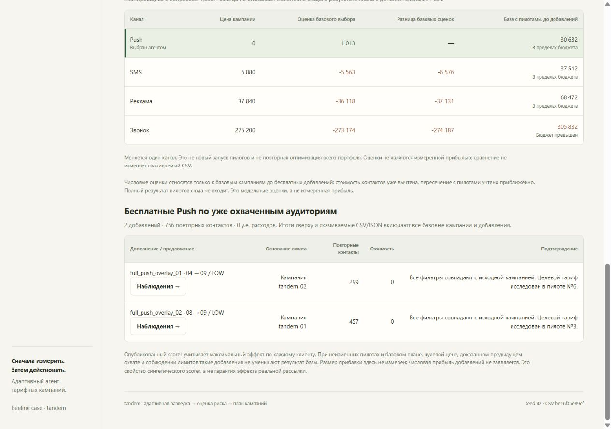
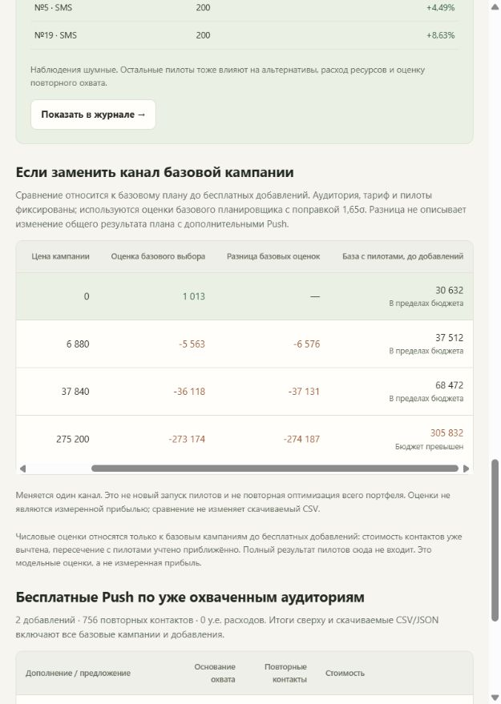

# Независимая приёмка tandem v1.3

**Результат: PASS в проверенном окружении. Блокирующих ошибок продукта не обнаружено.**

Краткая машинно-читаемая сводка: [acceptance.json](acceptance.json).

Проверена база `3af29c7aa40bf8c4467adb6654910b1c6077c7ae` в новом полном clone
репозитория, ветка `codex/push-acceptance`. Проверка выполнена 23 сентября 2026 года
на Windows 11 (`Windows-11-10.0.26200-SP0`), CPython 3.12.14, в новом `.venv`
без системных пакетов. Старое окружение и старые HTML/CSV для запуска не использовались.
Это чистая установка на доступном компьютере, не испытание на втором физическом устройстве.

Сначала установлен только `requirements.txt`: NumPy 2.5.3 и pandas 3.0.6;
pytest отсутствовал. Проверки runtime завершились до установки
`requirements-dev.txt`. После неё установлен pytest 9.1.1, версии runtime не изменились.
Доказательства: [окружение и команды](execution.json),
[runtime-пакеты](runtime_packages_stdout.txt), [пакеты до/после dev](dev_packages.json),
[dev-команды и времена](dev_execution.json).

## Приёмочная таблица

| Проверка | Статус | Фактический результат / доказательство |
|---|---|---|
| Новый clone, точный SHA, полная история Git | PASS | База выше; `full_git_history: true`, новое окружение в [execution.json](execution.json) |
| Установка runtime без dev | PASS | Exit 0; [stdout/stderr установки](install_runtime_stdout_stderr.txt); pytest до dev отсутствовал |
| `tools/verify_submission.py` | PASS | **37 OK**, exit 0, 3,89 с; [stdout](verify_stdout.txt), [stderr](verify_stderr.txt) |
| `tools/run_demo.py` | PASS | Новый полный запуск, exit 0, 3,531 с; [stdout](demo_stdout.txt), [stderr](demo_stderr.txt), [run_status](fresh_runs/run_20260923T115327Z_8kxp8qz9/run_status.json) |
| Результат seed 42 | PASS | **5 кампаний = 3 базовые + 2 добавки; 20 пилотов; 6732 контакта; 30632 у.е.; 2476 уникальных клиентов финала** |
| Вкладки и базовые кампании | PASS | Открыты все 3 вкладки, выбраны все 3 базовые кампании; для каждой показаны 4 канала и соответствующие прямые пилоты |
| Добавки и доказательства охвата | PASS | 299 и 457 повторных контактов, стоимость каждой 0; источники `tandem_02` и `tandem_01`; обе кнопки «Наблюдения» работают |
| Фильтры журнала | PASS | HIGH: 14; MID: 4; LOW: 2; все: 20. LOW + `tandem_03`: 0 и сообщение о пустом результате |
| CSV и JSON через кнопки HTML | PASS | Оба скачанных файла **побайтно совпадают** с артефактами свежего запуска; CSV содержит 5 строк кампаний |
| Сохранённый CSV и корневые артефакты | PASS | Новый CSV совпадает с сохранённым после CRLF → LF; корневые `submission.csv` и `reports/decision_trace.json` не изменились |
| Ширина 1280 px | PASS | Таблицы читаемы; таблицы каналов и добавок помещаются в контейнер шириной 961 px |
| Горизонтальная прокрутка | PASS | При viewport 640 px: таблица 680 px, контейнер 583 px; прокрутка меняет `scrollLeft` с 0 до 96,800003 px |
| Ошибки JavaScript | PASS | Во время открытия и взаимодействий наблюдатели `Runtime.exceptionThrown` / `Log.entryAdded` и console warn/error не зарегистрировали ошибок; [журнал браузера](browser_results.json) |
| Полный требуемый pytest | PASS | **122 passed in 11.39s**, **0 skipped**, exit 0; [stdout](pytest_stdout.txt), [stderr](pytest_stderr.txt) |

## Свежий HTML и проверенные взаимодействия

Открыт именно [HTML нового запуска](fresh_runs/run_20260923T115327Z_8kxp8qz9/decision_report.html)
из каталога `run_20260923T115327Z_8kxp8qz9`, созданного в 11:53:27 UTC.
Chrome получил его по `http://127.0.0.1:8765/decision_report.html` с HTTP 200.
Браузерная проверка выполнялась реальными нажатиями и изменением фильтров,
с чтением DOM и снимками экрана. Отказов доступа браузера не было.

| Выбранная базовая кампания | Аудитория / канал | Прямые пилоты |
|---|---|---|
| `tandem_01` | `tariff_8 → tariff_9`, LOW; 457 контактов, Реклама | №3 |
| `tandem_02` | `tariff_4 → tariff_9`, LOW; 299 контактов, Реклама | №6 |
| `tandem_03` | `tariff_8 → tariff_10`, MID; 1720 контактов, Push | №5 и №19 |

Для каждой кампании проверены строки Push, SMS, Реклама, Звонок.
Таблица прямо ограничивает сравнение базовым планом до добавлений, называет
значения оценками и не обещает изменение прибыли полного плана. Для `tandem_03`
звонок показывает превышение бюджета; исходный выбранный Push сохраняется.

В таблице добавок `full_push_overlay_01` показывает 299 повторных контактов,
источник `tandem_02`, совпадение фильтров и пилот целевого тарифа №6;
`full_push_overlay_02` — 457, источник `tandem_01` и пилот №3.
Кнопки «Наблюдения» открывают соответствующие фильтры журнала и показывают
ровно №6 и №3. В обоих случаях цена равна нулю. Общее дополнение — 756
повторных контактов. Подтверждение предыдущего охвата основано на базовой
кампании, а не на размере этих частичных пилотов.

Полные счётчики и скачиваемые файлы включают все 5 кампаний.
Всего 6732 контакта: 3500 пилотных и 3232 финальных. Расход 30632 у.е.:
14000 на пилоты и 16632 на финал. Финальных уникальных клиентов — 2476;
контакты не названы уникальными людьми. Размер прибыли добавок в UI не
заявляется и с оценками базы не складывается. Preflight содержит `errors: []`;
предупреждения об ожидаемом пересечении кампании №4 на 299 клиентов и №5
на 457 клиентов, всего 756 повторных контактов, показаны во вкладке
«Проверяемость». Это предупреждения проверки плана, а не ошибки JavaScript.

Одна попытка автоматизации выбора скачивания остановилась до нажатия:
во вкладке «Проверяемость» два видимых элемента имели одинаковую подпись,
поэтому строгий локатор оказался неоднозначным. Повторное действие использовало
наблюдаемые ID `download-csv` и `download-trace` и прошло успешно. Это ошибка
выбора элемента в проверке, не ошибка продукта; попытка сохранена в
[browser_results.json](browser_results.json).

### Снимки интерфейса

План при ширине 1280 px:


Добавки и подтверждение охвата при ширине 1280 px:



Проверка горизонтальной прокрутки при ширине 640 px:



## Скачанные файлы

[Проверка скачиваний](download_verification.json) фиксирует имена, время,
размеры, побайтное сравнение и SHA-256. Браузер добавил суффикс `(1)` к именам
скачанных файлов; это не изменило содержимое.

| Файл | Размер | SHA-256 свежего и скачанного файла |
|---|---:|---|
| CSV | 350 байт | `be16f35e89ef044fa7fb05a9436fc2422fe38b98a66afb2ba42b2d9eafca65e9` |
| JSON | 35052 байта | `ed420810fd7cbc2109ae8444a80a15f5ea1889444dd6efc9bd7cebb836ead7a8` |

Оба файла совпали уже по исходным байтам. Дополнительная проверка LF заменяет
только CRLF → LF: без обрезки пробелов, разбора JSON или изменения значений.
Корневой сохранённый CSV тоже совпал с новым по LF. Новый JSON относится к
этой версии Python и этому запуску; совпадение с прежним корневым JSON не требуется.
Неизменность самого корневого JSON проверена отдельно.

## Команды воспроизведения

Из нового каталога checkout с полной историей Git, используя Python 3.12:

```powershell
git clone https://github.com/BAITC-Hacks/hack-84050a93-tandem.git tandem-push-check
cd tandem-push-check
git switch -c codex/push-acceptance 3af29c7aa40bf8c4467adb6654910b1c6077c7ae
python -m venv .venv
.venv\Scripts\python.exe -m pip install -r requirements.txt
.venv\Scripts\python.exe tools/verify_submission.py --help
.venv\Scripts\python.exe tools/verify_submission.py
.venv\Scripts\python.exe tools/run_demo.py --output-root reports/push_acceptance/fresh_runs
# Открыть новый HTML по пути, напечатанному run_demo.
.venv\Scripts\python.exe -m pip install -r requirements-dev.txt
.venv\Scripts\python.exe -m pytest -q tests experiments/push_overlay
```

Для проверки через localhost можно обслужить **новый каталог**, напечатанный
`run_demo`, командой `python -m http.server 8765 --bind 127.0.0.1 --directory <новый_каталог>`
и открыть `http://127.0.0.1:8765/decision_report.html`.
Затем повторить выбор кампаний, обе кнопки добавок, фильтры и скачивания,
сверяя файлы именно с этим каталогом.

Реальные команды и exit codes находятся в [execution.json](execution.json) и
[dev_execution.json](dev_execution.json); установка runtime сохраняет stdout и
stderr совместно, остальные команды — раздельно. В публикуемых логах личные
абсолютные префиксы заменены на `<REPO>` / `<USERPROFILE>`, окончания строк
нормализованы в LF. Содержательные строки и результаты не удалялись.
Правило и хеши преобразованных логов: [log_transforms.json](log_transforms.json).
Артефакты CSV/JSON/HTML и скачанные файлы этими преобразованиями не менялись.

## Границы проверки

- **NOT CHECKED:** открытие через `file://`; использован Chrome через localhost.
- **NOT CHECKED:** просмотр при принудительно отключённой сети; надпись
  «Работает без сети» в интерфейсе сама по себе не считается доказательством.
- **NOT CHECKED:** Linux, macOS, другие браузеры и второй физический компьютер.
- Проверенные числа относятся к официальному синтетическому mock seed 42.
  Приёмка не предсказывает скрытый рейтинг и эффект реальных рассылок.

Новых оптимизаций и повторения 160 исследовательских пар не проводилось.
Производственные исходники, зависимости и корневые артефакты сохранены;
изменения этой ветки ограничены `reports/push_acceptance/`.
